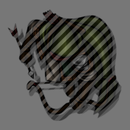

# Reveal Observable Tokens (Foundry VTT Module)

This module reveals tokens to non-GM users with Observer/Owner permissions regardless of vision. Observable/owned tokens that wouldn't be visible normally are highlighted by a hatched overlay.

